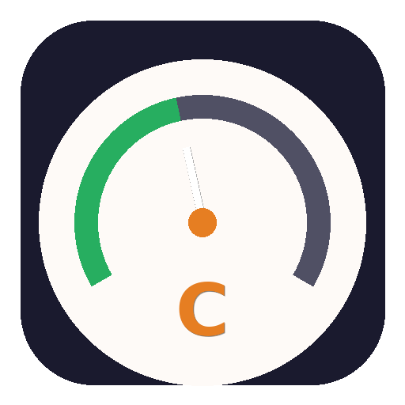
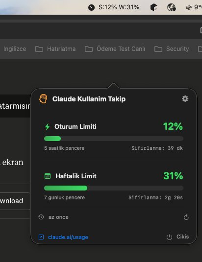

# Claude Usage Monitor

<p align="center">
  
</p>

<p align="center">
  <strong>macOS menu bar app that tracks your Claude.ai plan usage in real-time.</strong>
</p>

<p align="center">
  
  
  
  
</p>

<p align="center">
  <a href="https://github.com/YOUR_USERNAME/claude-usage-monitor/releases/latest">
    
  </a>
</p>

---

## Screenshot

<p align="center">
  
</p>

## Features

- **Menu Bar Widget** — See your session and weekly usage percentages at a glance
- **Session Limit** — 5-hour rolling window utilization with countdown timer
- **Weekly Limit** — 7-day usage tracking with reset time
- **Color Coded** — Green (0-50%) → Orange (50-80%) → Red (80-100%)
- **Customizable Refresh** — 5 / 10 / 15 / 20 / 25 / 30 minute intervals
- **Rate Limit Aware** — Respects `retry-after` headers, no unnecessary requests
- **Dock-Free** — Lives only in the menu bar, no Dock icon
- **Native macOS** — Built with SwiftUI, no Electron, no web views

## Download & Install

### Option 1: Download DMG (Easiest)

1. Go to [**Releases**](https://github.com/YOUR_USERNAME/claude-usage-monitor/releases/latest)
2. Download `ClaudeUsageMonitor.dmg`
3. Open the DMG and drag the app to Applications
4. Launch from Applications

> ⚠️ On first launch macOS may say "unidentified developer". Right-click the app → Open → Open to bypass.

### Option 2: Build from Source

```bash
git clone https://github.com/YOUR_USERNAME/claude-usage-monitor.git
cd claude-usage-monitor
chmod +x build.sh
./build.sh
```

### Prerequisites (Build from Source only)

```bash
xcode-select --install    # if not already installed
```

## Requirements

| Requirement | Details |
|---|---|
| Mac | Apple Silicon (M1/M2/M3/M4) |
| macOS | 13.0 Ventura or later |
| Claude.ai Account | Pro, Max, Team, or Enterprise plan |

## Setup

After launching, click the gauge icon (⏱) in the menu bar:

### 1. Get Session Key

1. Open **claude.ai/settings/usage** in Chrome
2. Press **F12** → **Network** tab
3. Refresh the page (**Cmd+R**)
4. Click the **usage** request
5. In **Headers** → **Cookie**, find `sessionKey=sk-ant-sid02-XXXXX...`
6. Copy only the `sk-ant-sid02-...` part

### 2. Get Organization ID

From the same request URL:

```
https://claude.ai/api/organizations/XXXXXXXX-XXXX-XXXX-XXXX-XXXXXXXXXXXX/usage
                                     ^^^^^^^^^^^^^^^^^^^^^^^^^^^^^^^^^^^^^^^^
                                     Copy this UUID
```

### 3. Enter & Save

Paste both values → Click **"Kaydet ve Kontrol Et"**

## How It Works

```
GET https://claude.ai/api/organizations/{orgId}/usage
Cookie: sessionKey={key}
```

```json
{
  "five_hour": { "utilization": 12.0, "resets_at": "2026-03-18T19:30:00Z" },
  "seven_day": { "utilization": 31.0, "resets_at": "2026-03-22T03:00:00Z" }
}
```

> **Note:** This uses an undocumented internal API. It may change without notice.

## Menu Bar Format

| Display | Meaning |
|---|---|
| `S:12% W:31%` | Session 12%, Weekly 31% |
| `S:85% W:31% ⚠` | Warning — any value ≥ 80% |
| `Ayarla` | Not configured yet |

## Color Coding

| Usage | Color | Status |
|---|---|---|
| 0% – 50% | 🟢 Green | Safe |
| 50% – 80% | 🟠 Orange | Caution |
| 80% – 100% | 🔴 Red | Near limit |

## Troubleshooting

| Error | Solution |
|---|---|
| Token geçersiz | Re-extract session key from DevTools (keys expire periodically) |
| HTTP 429 | Rate limited — app auto-retries after cooldown |
| HTTP 403 | Session expired — get a new session key |
| Veri Alınamadı | Verify both Session Key and Organization ID |

## Security

- Session key stored **locally only** in macOS UserDefaults
- No third-party data sharing
- Connects only to `claude.ai`
- Zero analytics, telemetry, or tracking

## Project Structure

```
claude-usage-monitor/
├── ClaudeUsageMonitor.swift   # Single-file SwiftUI app
├── build.sh                   # Build + package + install
├── AppIcon.iconset/           # macOS icon assets (16px → 1024px)
├── assets/
│   ├── icon-preview.png
│   └── screenshot.png
├── .github/
│   └── workflows/
│       └── release.yml        # Auto-build DMG on tag push
├── LICENSE
├── .gitignore
└── README.md
```

## Creating a Release

Push a version tag to automatically build and upload a `.dmg`:

```bash
git tag v2.1.0
git push origin v2.1.0
```

GitHub Actions will compile, package, and attach the DMG to the release.

## Contributing

Contributions welcome! Ideas:

- [ ] Notification when usage exceeds threshold
- [ ] Keyboard shortcut to toggle popover
- [ ] Usage history chart
- [ ] Export to CSV
- [ ] Intel Mac support (`x86_64`)
- [ ] Auto-update via Sparkle

## License

MIT License — see [LICENSE](LICENSE) for details.

---

<p align="center">
  <sub>Built with ❤️ for Claude power users</sub>
</p>
